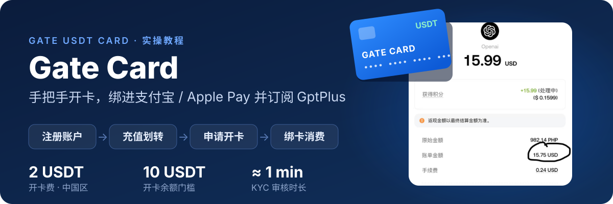
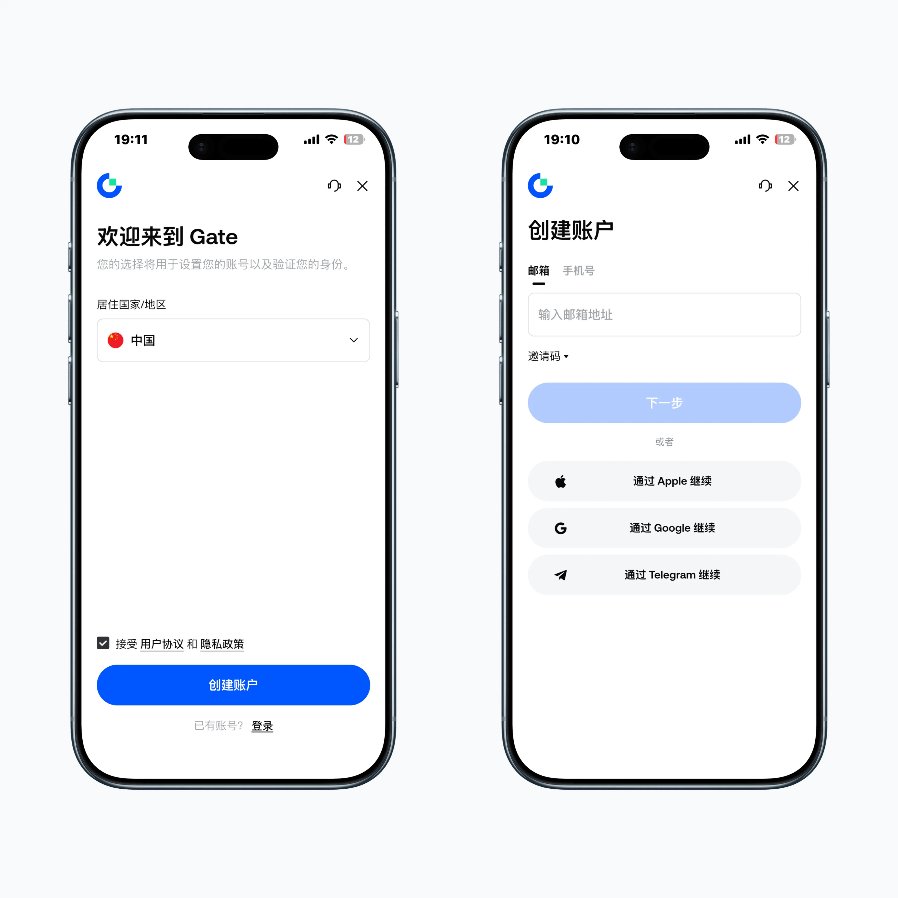
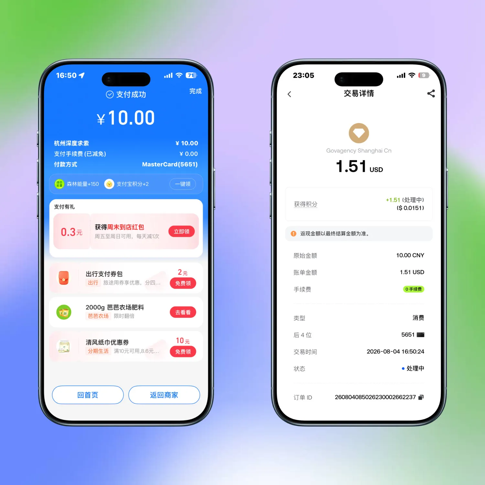
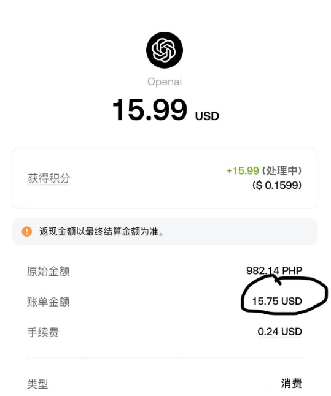
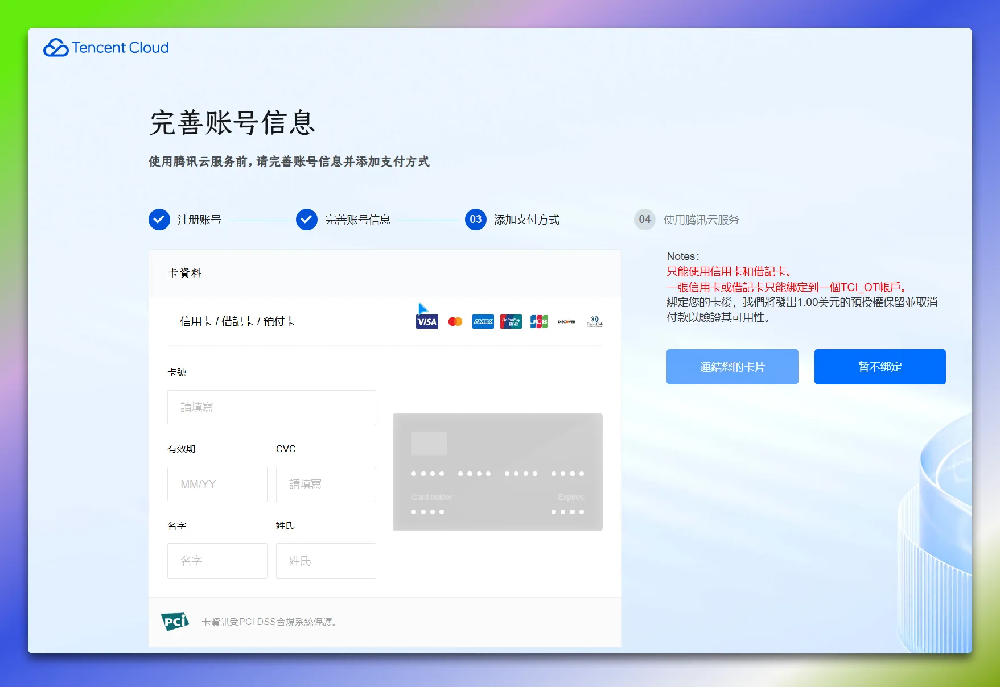

  

### 一、注册 Gate 账户

推荐先通过网页端完成注册，再下载 App 操作，体验更顺畅。
- **网页快捷注册**：[点击进入 Gate 注册页面](https://app.bxjddjt.com/card/redirect?key=invite&invite_code=VFYXXQHCVA)
- **邀请码**：VFYXXQHCVA（注册时填写，感谢支持）

1. **下载 App**：苹果商店 ID 切换至美区，搜索「Gate」下载并安装。
2. **选择地区**：打开 App 登录刚注册的账号，点击账户，居住国家/地区选择「中国」。
3. **App 内创建账号（备选）**：如果没有在网页注册，也可直接在 App 内使用手机号，或通过苹果/谷歌/Telegram 授权登录注册（同样可填入邀请码）。

### 二、充值与划转资金

进入开卡步骤前，需确保账户内有足够资金（开卡要求可用余额至少 10 USDT，选择中国区需 2U 开卡费，建议直接提币充值 13U）。

**方法一：适合自己，没有钱包，没有交易所的纯小白。**
1. 打开gate交易所页面上的充值，选择CTC交易，用支付宝买入USDT，尽量找靠谱的商家。
2. **划转至 Pay 账户**：回到 Gate App，切换至「Pay」页面，点击「充值」-> 来源选择「交易所」，全部划转即可。

**方法二：自己的其他交易所或者钱包里面有钱的话，可以通过此方法。**
1. **获取充值地址**：在 Gate App 切换至「交易所」页面，点击「充值」->「链上充值」-> 币种选择「USDT」-> 网络选择「BNB」，复制地址。
2. **提币充值**：打开 OKX（或其他交易所），通过 BNB 网络提现 USDT 至刚复制的 Gate 充值地址
3. **划转至 Pay 账户**：回到 Gate App，切换至「Pay」页面，点击「充值」-> 来源选择「交易所」，全部划转即可。

### 三、申请 Gate Card

1. **进入申请页面**：在 Gate App 切换至「Pay」页面 -> 选择「Gate Card」（导航栏第 3 个图标）-> 点击「立即申请」。
2. **KYC 身份认证**：
   - 居住地与国籍均选择「中国」，证件类型选择「身份证」。
   - 提交后审核大约需 1 分钟。
3. **填写申请信息**：
   - 居住地选择「中国」，绑定邮箱并完成验证码验证。
   - 填写职业、年收入等个人信息。
4. **确认卡片信息（关键环节）**：
   - 在最后的确认信息界面，**姓名请务必使用拼音**填写全拼。如果填英文名，大概率会因为“全名缺失或有误”被驳回审核。

### 四、查看信息与绑卡消费

1. **获取卡片详情**：在 Gate Card 卡片页面点击「管理」->「查看卡片详情」，通过邮箱验证后即可看到完整卡号、有效期和 CVV（建议手动保存至本地）。
2. **绑定 Apple Pay**：打开苹果钱包 App -> 右上角「+」->「借记卡或信用卡」->「添加其他卡片」-> 输入卡片信息并验证邮箱，完成绑定。
3. **绑定支付宝**：打开支付宝 ->「银行卡」-> 录入卡号、CVV 和有效期即可。
4. **日常充值**：后续消费前，在卡片页面点击「充值」，将 USDT 从 **Pay 账户** 划入 **Gate Card** 即可消费。

### 五、补充注意事项

1. **关于开卡地区**：建议老老实实选「中国」付 2U 开卡费。选「菲律宾」虽然免费，但容易触发地址认证，实测提交 Maya 地址证明通常无法通过。
2. **关于卡组织**：下发卡片类型由系统决定，有人开出 VISA，有人开出 Mastercard（本次作者申请下发的是 Mastercard）。
3. **关于日常绑卡**：Apple Pay、支付宝较稳；美团实测基本可以直接刷；微信绑定存在一定“玄学”，有人能绑有人绑不上。

### 后续实践
#### 1. 线下线上支付宝购物

今天线上Deepseek 充值 10 元，支付宝直接从 U 卡扣了 1.51美元

这张卡办下来，绑了支付宝之后，线下还真没用过

昨天在超市买了点东西，一共 9.24元，结账直接打开支付宝扫了一下，没跳验证，也没多余操作，直接付款成功。后面去 Gate 看了下账单，实际扣了 1.4 USD，手续费是 0，积分也加了 1.4，返现还在处理中。

金额不大，但这种日常场景最能看出方不方便。不用临时换汇，也不用来回转，平时买菜、买水，支付宝直接扫就能花。

申请的时候门槛也不高，不用 VIP，顺手办了一张。现在看来，放支付宝里当张日常备用卡还挺实用。

 #### 2 订阅Gpt  Mastercard或Apple Pay方式
可能会拒绝，解决办法：可以试一下手机网页端 → Google Pay → U卡
https://x.com/wei_yuann/status/2088185112001417706?s=20

3参加活动

- Fly.io零元部署openlist需绑卡（余额需10刀以上）
- EdgeOne

- AWS S3--Cloudflare R2&全球CDN图床
- AWS免费服务器

---

## 👨‍💻 关于我

**大强同学（Derek Zhao）**
AI 工具与工作流实践者 · GitHub 开源项目作者
我在 Windows、AI Agent、Obsidian 和个人网站这些真实场景里，
把能跑通的工具、Skill 和流程，整理成可复用的开源项目与交付方案。

- GPT/Claude 自助充值：[ai.dqtx.cc](https://ai.dqtx.cc/)
- Gemini pro 18 个月：[点此查看](https://xodnytdcaw.feishu.cn/docx/TNBZdcIjAo0U0SxPyXtczir1n3d?from=from_copylink)
- X Premium 蓝 V 代充：三个月 50、半年 88
- 文章与工具：[dqtx.cc](https://www.dqtx.cc/) · [os.dqtx.cc](https://os.dqtx.cc/) · [blog.dqtx.cc](https://blog.dqtx.cc/)
- 关注更新：[B 站](https://space.bilibili.com/491358682/upload/video) · [YouTube](https://www.youtube.com/@dqtx760/videos) · [X](https://x.com/dqtx760)
- 公众号：微信搜索「大强同学」

卡在安装、配置、报错，或想把 AI 接进自己的工作流，可以直接找我。
